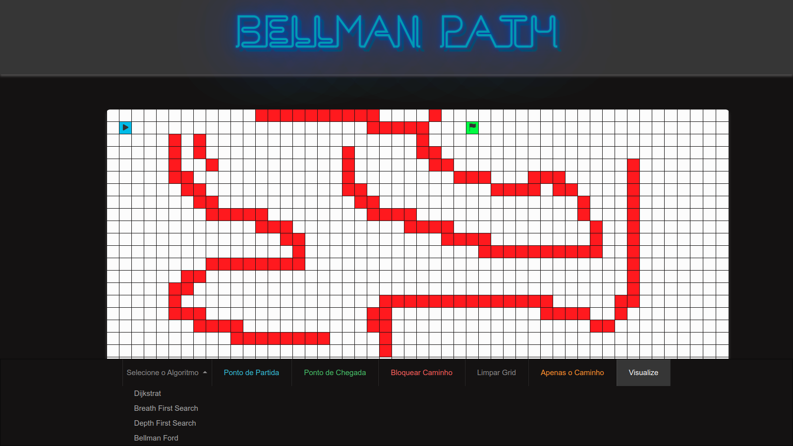
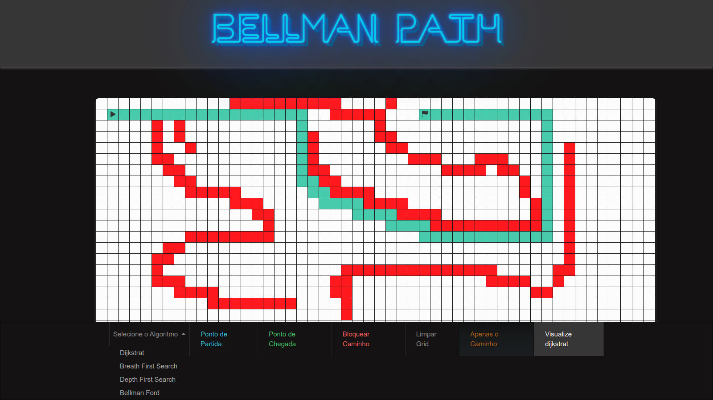
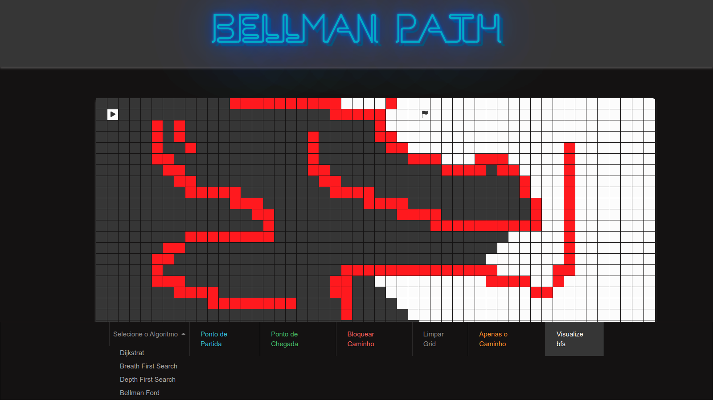

# Bellman Path

**Número da Lista**: 5 
**Conteúdo da Disciplina**: Programação Dinâmica 

## Alunos
|Matrícula | Aluno |
| -- | -- |
| 17/0062686 |  Pedro Rodrigues Pereira |
| 17/0008371 |  Daniel de Sousa Oliveira Melo Veras |

## Sobre 
O projeto tem como objetivo demonstrar a visualização de algoritmos e como eles definem um caminho entre o ponto de partida e o ponto de chegada. O projeto conta com quatro algoritmos diferentes para atingir o destino, sendo eles:

* Bellmman
* dijkstra
* Depth First Search
* Breath First Search

## Screenshots

### Ponto de partida e fim definidos

### Apenas o caminho

### Algoritmos trabalhando

## Instalação 
**Linguagem**: Typescript e HTML 
 
O projeto não demanda instalação. Basta abrir o arquivo **index.html**, presente na raiz no projeto.

## Uso 

Após abrir o arquivo **index.html** presente na raiz do projeto, se faz necessário selecionar o algoritmo, selecionar um ponto de partida e um ponto de destino. A partir desse ponto é possível optar entre visualizar apenas o caminho ou todo processo do algoritmo.
